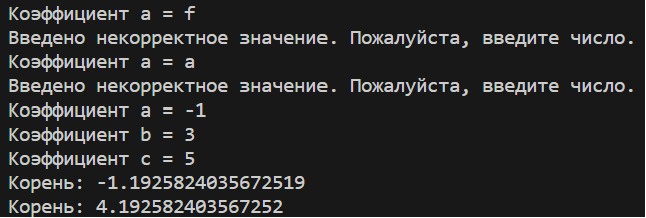

## Project Summary
Реализуйте игру в кости. Играют N игроков (компьютер в списке последний). Подкидываются одновременно К кубиков. Выигрывает тот, у кого большая сумма очков. Кто выиграл, тот и кидает первым в следующем кону. Игра идет до 7 выигрышей. Начинаете игру вы.
## Screen

## Sources
### https://github.com/lnetrebskii/samgtu/blob/main/1_semester/java/practicals/task_01/1-quadratic-equation/src/main/java/DiceGame.java
```java
import java.util.HashMap;
import java.util.Map;

/**
 * Класс, представляющий игру в кости.
 */
public class DiceGame {

  // Константа для определения необходимого количества победных раундов, чтобы
  // считать игру завершенной.
  private static final int NUMBER_WINNED_ROUNDS_TO_WIN = 7;

  // Массив всех игроков
  private Player[] players;
  // Количество кубиков для броска
  private int K;
  // Игрок, начинающий раунд
  private Player startingPlayer;

  public DiceGame(Player[] players, int K) {
    this.players = players;
    this.K = K;
    this.startingPlayer = players[0];
  }

  /**
   * @return Возвращает игрока, начинающего раунд.
   */
  public Player getStartingPlayer() {
    return startingPlayer;
  }

  /**
   * Производит раунд игры и возвращает результат.
   *
   * @return Результат раунда.
   */
  public RoundResult playRound() {
    Player roundWinner = startingPlayer;
    int maxRoll = 0;
    Map<Player, Integer> rolls = new HashMap<>();

    for (Player player : players) {
      int currentRoll = player.roll(K);
      rolls.put(player, currentRoll);
      if (currentRoll > maxRoll) {
        maxRoll = currentRoll;
        roundWinner = player;
      }
    }

    roundWinner.incrementScore();
    startingPlayer = roundWinner;

    return new RoundResult(roundWinner, rolls);
  }

  /**
   * @return Возвращает победителя игры или null, если игра еще не завершена.
   */
  public Player getWinner() {
    for (Player player : players) {
      if (player.getScore() == NUMBER_WINNED_ROUNDS_TO_WIN) {
        return player;
      }
    }
    return null;
  }
}
```
### https://github.com/lnetrebskii/samgtu/blob/main/1_semester/java/practicals/task_01/1-quadratic-equation/src/main/java/Human.java
```java
import java.util.Scanner;

/**
 * Класс, представляющий человека-игрока.
 */
class Human extends Player {
  // Сканер для ввода данных
  private Scanner scanner = new Scanner(System.in);

  public Human(String name) {
    super(name);
  }

  /**
   * Просит игрока нажать 'k' для броска кубиков и возвращает результат.
   *
   * @param numberOfDice Количество кубиков для броска.
   * @return Общая сумма очков с кубиков.
   */
  @Override
  public int roll(int numberOfDice) {
    String input = "";
    while (!input.equals("k")) {
      System.out.printf("%s, введите 'k' чтобы бросить кости.\n", super.getName());
      input = scanner.nextLine();
    }

    return super.roll(numberOfDice);
  }
}
```
### https://github.com/lnetrebskii/samgtu/blob/main/1_semester/java/practicals/task_01/1-quadratic-equation/src/main/java/Main.java
```java
import java.util.ArrayList;
import java.util.List;
import java.util.Map;
import java.util.Scanner;

public class Main {

  // Константа для определения количества костей.
  private static final int NUMBER_OF_DICE = 2;

  public static void main(String[] args) {
    Scanner scanner = new Scanner(System.in);
    List<Player> players = new ArrayList<>();

    while (true) {
      System.out.print("Введите имя игрока (или оставьте пустым): ");
      String name = scanner.nextLine().trim();

      if (name.isEmpty()) {
        name = "Player " + (players.size() + 1);
      }

      players.add(new Human(name));

      System.out.print("Хотите добавить еще игрока? (y/n): ");
      String input = scanner.nextLine();

      if (!input.equalsIgnoreCase("y")) {
        break;
      }
    }

    // Добавляем компьютера в качестве последнего игрока.
    players.add(new Player("Компьютер"));

    DiceGame game = new DiceGame(players.toArray(new Player[0]), NUMBER_OF_DICE);

    while (game.getWinner() == null) {
      RoundResult result = game.playRound();
      displayRoundResult(result);
      System.out.println(game.getStartingPlayer().getName() + " начинает следующий раунд.");
    }

    System.out.println(game.getWinner().getName() + " выиграл игру!");
  }

  /**
   * Выводит на экран результат раунда.
   *
   * @param result Результат раунда.
   */
  private static void displayRoundResult(RoundResult result) {
    for (Map.Entry<Player, Integer> entry : result.getRolls().entrySet()) {
      System.out.println(entry.getKey().getName() + " выбросил: " + entry.getValue());
    }
    System.out.println(result.getWinner().getName() + " выиграл раунд!");
  }
}
```
### https://github.com/lnetrebskii/samgtu/blob/main/1_semester/java/practicals/task_01/1-quadratic-equation/src/main/java/Player.java
```java
import java.util.Random;

/**
 * Класс, представляющий игрока.
 */
public class Player {
  // Имя игрока
  private String name;
  // Общий счет игрока
  private int score;

  /**
   * Конструктор класса Player.
   *
   * @param name Имя игрока.
   */
  public Player(String name) {
    this.name = name;
  }

  /**
   * @return Возвращает имя игрока.
   */
  public String getName() {
    return name;
  }

  /**
   * @return Возвращает текущий счет игрока.
   */
  public int getScore() {
    return score;
  }

  /**
   * Увеличивает счет игрока на одно очко.
   */
  public void incrementScore() {
    this.score++;
  }

  /**
   * Бросает заданное количество кубиков и возвращает общее количество очков.
   *
   * @param numberOfDice Количество кубиков для броска.
   * @return Общая сумма очков с кубиков.
   */
  public int roll(int numberOfDice) {
    Random rand = new Random();
    int roll = 0;
    for (int j = 0; j < numberOfDice; j++) {
      roll += rand.nextInt(6) + 1;
    }
    return roll;
  }
}
```
### https://github.com/lnetrebskii/samgtu/blob/main/1_semester/java/practicals/task_01/1-quadratic-equation/src/main/java/RoundResult.java
```java
import java.util.Map;

/**
 * Класс, представляющий результат раунда игры.
 */
public class RoundResult {
  // Победитель раунда
  private Player winner;
  // Результаты бросков всех игроков
  private Map<Player, Integer> rolls;

  public RoundResult(Player winner, Map<Player, Integer> rolls) {
    this.winner = winner;
    this.rolls = rolls;
  }

  /**
   * @return Возвращает победителя раунда.
   */
  public Player getWinner() {
    return winner;
  }

  /**
   * @return Возвращает карту с результатами бросков для всех игроков.
   */
  public Map<Player, Integer> getRolls() {
    return rolls;
  }
}
```
## Tests
### https://github.com/lnetrebskii/samgtu/blob/main/1_semester/java/practicals/task_01/1-quadratic-equation/src/test/java/DiceGameTest.java
```java
import static org.junit.jupiter.api.Assertions.*;
import org.junit.jupiter.api.Test;

class DiceGameTest {

  @Test
  void playerWhoWinsSevenTimesShouldBeWinner() {
    
    Player player = new Player("Test");
    DiceGame game = new DiceGame(new Player[] { player }, 1);

    for (int i = 0; i < 7; i++) {
      game.playRound();
    }

    assertEquals(player, game.getWinner(), "Player who won 7 rounds should be the game winner.");
  }
}
```
### https://github.com/lnetrebskii/samgtu/blob/main/1_semester/java/practicals/task_01/1-quadratic-equation/src/test/java/PlayerTest.java
```java
import org.junit.jupiter.api.BeforeEach;
import org.junit.jupiter.api.Test;
import static org.junit.jupiter.api.Assertions.*;

class PlayerTest {
  private Player player;

  @BeforeEach
  void setUp() {
    player = new Player("TestPlayer");
  }

  @Test
  void incrementScore() {
    player.incrementScore();
    assertEquals(1, player.getScore());
  }

  @Test
  void roll() {
    int result = player.roll(2); // бросаем 2 кубика
    assertTrue(result >= 2 && result <= 12); // сумма очков должна быть между 2 и 12 включительно
  }
}
```
### https://github.com/lnetrebskii/samgtu/blob/main/1_semester/java/practicals/task_01/1-quadratic-equation/src/test/java/RoundResultTest.java
```java
import org.junit.jupiter.api.BeforeEach;
import org.junit.jupiter.api.Test;
import static org.junit.jupiter.api.Assertions.*;

import java.util.HashMap;
import java.util.Map;

class RoundResultTest {
  private RoundResult roundResult;
  private Player player1;
  private Player player2;
  private Map<Player, Integer> rolls;

  @BeforeEach
  void setUp() {
    player1 = new Player("Player1");
    player2 = new Player("Player2");
    rolls = new HashMap<>();
    rolls.put(player1, 5);
    rolls.put(player2, 3);
    roundResult = new RoundResult(player1, rolls);
  }

  @Test
  void getWinner() {
    assertEquals(player1, roundResult.getWinner());
  }

  @Test
  void getRolls() {
    assertEquals(rolls, roundResult.getRolls());
  }
}
```
## Package
Path: 
https://github.com/lnetrebskii/samgtu/blob/main/1_semester/java/practicals/task_01/1-quadratic-equation/quadratic-equation-1.0-SNAPSHOT.jar
### QR Code to package

