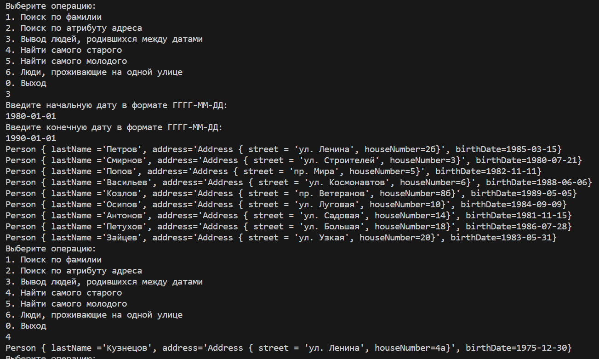

## Project Summary
Напишите программу «Адрес человека». Есть сущность Человек, 
        которая связана с сущностью Адрес. Считается, что у каждого человека есть 
        только один адрес. Организовать массив объектов Человек (не менее 4) и по 
        массиву:
         осуществить поиск человека по фамилии;
         осуществить поиск человека по атрибуту адреса;
         вывести людей, родившихся между определенными датами;
         найти самого старого (молодого);
         найти людей, проживающих на одной улице.
## Screen

## Sources
**https://github.com/lnetrebskii/samgtu/blob/main/1_semester/java/practicals/task_01/3-address/src/main/java/com/example/Main.java**
```java
package com.example;

import com.example.model.Person;
import com.example.repository.DataRepository;
import com.fasterxml.jackson.databind.ObjectMapper;
import com.fasterxml.jackson.databind.type.CollectionType;
import com.fasterxml.jackson.datatype.jsr310.JavaTimeModule;

import java.io.InputStream;
import java.time.LocalDate;
import java.util.ArrayList;
import java.util.Arrays;
import java.util.List;
import java.util.Scanner;

/**
 * Главный класс приложения, предоставляющего функциональность для поиска и
 * просмотра информации о людях на основе данных из файла.
 */
public class Main {

  public static void main(String[] args) {
    // Загрузка данных о людях из файла
    List<Person> persons = loadPersonsData();

    // Инициализация репозитория с загруженными данными
    DataRepository repository = new DataRepository(persons);

    Scanner scanner = new Scanner(System.in);
    while (true) {
      // Предоставление пользователю меню для выбора действия
      System.out.println("Выберите операцию:");
      System.out.println("1. Поиск по фамилии");
      System.out.println("2. Поиск по атрибуту адреса");
      System.out.println("3. Вывод людей, родившихся между датами");
      System.out.println("4. Найти самого старого");
      System.out.println("5. Найти самого молодого");
      System.out.println("6. Люди, проживающие на одной улице");
      System.out.println("0. Выход");

      int choice;
      try {
        choice = Integer.parseInt(scanner.nextLine());
      } catch (NumberFormatException e) {
        System.out.println("Неверный ввод. Попробуйте снова.");
        continue;
      }

      List<Person> foundPersons = null;

      // Обработка выбора пользователя
      switch (choice) {
        case 1:
          System.out.println("Введите фамилию:");
          String lastName = scanner.nextLine();
          foundPersons = repository.findByLastName(lastName);
          break;
        case 2:
          System.out.println("Введите любой атрибут адреса (дом или улицу):");
          String address = scanner.nextLine();
          foundPersons = repository.findByAddressAttribute(address);
          break;
        case 3:
          System.out.println("Введите начальную дату в формате ГГГГ-ММ-ДД:");
          String startStr = scanner.nextLine();
          System.out.println("Введите конечную дату в формате ГГГГ-ММ-ДД:");
          String endStr = scanner.nextLine();
          LocalDate startDate, endDate;
          try {
            startDate = LocalDate.parse(startStr);
            endDate = LocalDate.parse(endStr);
          } catch (Exception e) {
            System.out.println("Ошибка в формате даты.");
            continue;
          }
          foundPersons = repository.findBetweenDates(startDate, endDate);
          break;
        case 4:
          foundPersons = new ArrayList<>(Arrays.asList(repository.findOldest()));
          break;
        case 5:
          foundPersons = new ArrayList<>(Arrays.asList(repository.findYoungest()));
          break;
        case 6:
          System.out.println("Введите улицу:");
          String commonStreet = scanner.nextLine();
          foundPersons = repository.findByStreet(commonStreet);
          // Добавить логику поиска по улице
          break;
        case 0:
          System.out.println("Выход...");
          return;
        default:
          System.out.println("Неверный выбор. Попробуйте снова.");
      }

      printPersonsData(foundPersons);
    }
  }

  /**
   * Загрузка данных о людях из файла в формате JSON.
   * 
   * @return Список людей, загруженных из файла.
   */
  private static List<Person> loadPersonsData() {
    ObjectMapper mapper = new ObjectMapper();
    mapper.registerModule(new JavaTimeModule());
    try {
      InputStream is = Main.class.getClassLoader().getResourceAsStream("persons.json");
      CollectionType listType = mapper.getTypeFactory().constructCollectionType(ArrayList.class, Person.class);
      return mapper.readValue(is, listType);
    } catch (Exception e) {
      e.printStackTrace();
      return new ArrayList<>();
    }
  }

  /**
   * Вывод списка людей на экран.
   * 
   * @param persons Список людей для вывода.
   */
  private static void printPersonsData(List<Person> persons) {
    for (Person person : persons) {
      System.out.println(person);
    }
  }
}
```
**https://github.com/lnetrebskii/samgtu/blob/main/1_semester/java/practicals/task_01/3-address/src/main/java/com/example/model/Address.java**
```java
package com.example.model;

/**
 * Класс для представления адреса человека.
 * Содержит улицу и номер дома.
 */
public class Address {
  // Улица, на которой расположен адрес
  private String street;

  // Номер дома по указанной улице
  private String houseNumber;

  /**
   * Конструктор по умолчанию.
   * Инициализирует пустой объект Address.
   */
  public Address() {
    super();
  }

  /**
   * Конструктор с параметрами для инициализации адреса.
   * 
   * @param street      Улица адреса
   * @param houseNumber Номер дома адреса
   */
  public Address(String street, String houseNumber) {
    this.street = street;
    this.houseNumber = houseNumber;
  }

  /**
   * Получение улицы адреса.
   * 
   * @return Название улицы.
   */
  public String getStreet() {
    return street;
  }

  /**
   * Установка улицы адреса.
   * 
   * @param street Название улицы для установки.
   */
  public void setStreet(String street) {
    this.street = street;
  }

  /**
   * Получение номера дома адреса.
   * 
   * @return Номер дома.
   */
  public String getHouseNumber() {
    return houseNumber;
  }

  /**
   * Установка номера дома адреса.
   * 
   * @param houseNumber Номер дома для установки.
   */
  public void setHouseNumber(String houseNumber) {
    this.houseNumber = houseNumber;
  }

  /**
   * Представление адреса в виде строки.
   * 
   * @return Строковое представление адреса.
   */
  @Override
  public String toString() {
    return "Address { street = '" + this.street + "', houseNumber=" + this.houseNumber + "}";
  }
}
```
**https://github.com/lnetrebskii/samgtu/blob/main/1_semester/java/practicals/task_01/3-address/src/main/java/com/example/model/Person.java**
```java
package com.example.model;

import java.time.LocalDate;

/**
 * Класс для представления человека.
 * Содержит фамилию, дату рождения и адрес.
 */
public class Person {
    // Фамилия человека
    private String lastName;

    // Дата рождения человека
    private LocalDate birthDate;

    // Адрес проживания человека
    private Address address;

    /**
     * Конструктор по умолчанию.
     * Инициализирует пустой объект Person.
     */
    public Person() {
        super();
    }

    /**
     * Конструктор с параметрами для инициализации человека.
     * 
     * @param lastName  Фамилия человека
     * @param birthDate Дата рождения человека
     * @param address   Адрес проживания человека
     */
    public Person(String lastName, LocalDate birthDate, Address address) {
        this.lastName = lastName;
        this.birthDate = birthDate;
        this.address = address;
    }

    /**
     * Получение фамилии человека.
     * 
     * @return Фамилия человека.
     */
    public String getLastName() {
        return lastName;
    }

    /**
     * Получение даты рождения человека.
     * 
     * @return Дата рождения.
     */
    public LocalDate getBirthDate() {
        return birthDate;
    }

    /**
     * Получение адреса проживания человека.
     * 
     * @return Адрес проживания.
     */
    public Address getAddress() {
        return address;
    }

    /**
     * Представление человека в виде строки.
     * 
     * @return Строковое представление человека.
     */
    @Override
    public String toString() {
        return "Person { lastName ='" + this.lastName + "', address='" + this.address + "', birthDate=" + this.birthDate + "}";
    }
}
```
**https://github.com/lnetrebskii/samgtu/blob/main/1_semester/java/practicals/task_01/3-address/src/main/java/com/example/repository/DataRepository.java**
```java
package com.example.repository;

import com.example.model.Person;
import java.time.LocalDate;
import java.util.Comparator;
import java.util.List;
import java.util.stream.Collectors;

/**
 * Репозиторий для работы с данными о людях.
 * Предоставляет методы для поиска и фильтрации информации о людях.
 */
public class DataRepository {

  // Список людей, с которыми работает репозиторий
  private List<Person> persons;

  /**
   * Конструктор класса.
   * 
   * @param persons Список людей для инициализации репозитория.
   */
  public DataRepository(List<Person> persons) {
    this.persons = persons;
  }

  /**
   * Поиск людей по фамилии.
   * 
   * @param lastName Фамилия для поиска.
   * @return Список людей с указанной фамилией.
   */
  public List<Person> findByLastName(String lastName) {
    return persons.stream()
        .filter(person -> person.getLastName().equalsIgnoreCase(lastName))
        .collect(Collectors.toList());
  }

  /**
   * Поиск людей по атрибуту адреса (улица или номер дома).
   * 
   * @param address Атрибут адреса для поиска.
   * @return Список людей, соответствующих указанному атрибуту адреса.
   */
  public List<Person> findByAddressAttribute(String address) {
    return persons.stream()
        .filter(person -> person.getAddress().getStreet().equalsIgnoreCase(address)
            || person.getAddress().getHouseNumber().equalsIgnoreCase(address))
        .collect(Collectors.toList());
  }

  /**
   * Поиск людей, родившихся между определенными датами.
   * 
   * @param startDate Начальная дата.
   * @param endDate   Конечная дата.
   * @return Список людей, родившихся между указанными датами.
   */
  public List<Person> findBetweenDates(LocalDate startDate, LocalDate endDate) {
    return persons.stream()
        .filter(person -> (person.getBirthDate().isAfter(startDate) || person.getBirthDate().isEqual(startDate))
            && (person.getBirthDate().isBefore(endDate) || person.getBirthDate().isEqual(endDate)))
        .collect(Collectors.toList());
  }

  /**
   * Поиск самого старого человека.
   * 
   * @return Самый старый человек из списка.
   */
  public Person findOldest() {
    return persons.stream()
        .min(Comparator.comparing(Person::getBirthDate))
        .orElse(null);
  }

  /**
   * Поиск самого молодого человека.
   * 
   * @return Самый молодой человек из списка.
   */
  public Person findYoungest() {
    return persons.stream()
        .max(Comparator.comparing(Person::getBirthDate))
        .orElse(null);
  }

  /**
   * Поиск людей по улице проживания.
   * 
   * @param street Улица для поиска.
   * @return Список людей, проживающих на указанной улице.
   */
  public List<Person> findByStreet(String street) {
    return persons.stream()
        .filter(person -> person.getAddress().getStreet().equalsIgnoreCase(street))
        .collect(Collectors.toList());
  }
}
```
## Tests
**https://github.com/lnetrebskii/samgtu/blob/main/1_semester/java/practicals/task_01/3-address/src/test/java/DataRepositoryTest.java**
```java
import com.example.repository.DataRepository;
import com.example.model.*;

import com.example.model.Person;
import com.example.model.Address;
import org.junit.jupiter.api.BeforeEach;
import org.junit.jupiter.api.Test;

import java.time.LocalDate;
import java.util.Arrays;
import java.util.List;

import static org.junit.jupiter.api.Assertions.assertEquals;

public class DataRepositoryTest {

    private DataRepository repository;

    @BeforeEach
    public void setUp() {
        Address address1 = new Address("Green Street", "5a");
        Address address2 = new Address("Blue Street", "10b");
        Address address3 = new Address("Green Street", "7");
        Address address4 = new Address("Red Street", "3");

        Person person1 = new Person("Doe", LocalDate.of(1990, 1, 10), address1);
        Person person2 = new Person("Smith", LocalDate.of(1985, 5, 20), address2);
        Person person3 = new Person("Doe", LocalDate.of(2000, 7, 15), address3);
        Person person4 = new Person("Taylor", LocalDate.of(1995, 11, 30), address4);

        repository = new DataRepository(Arrays.asList(person1, person2, person3, person4));
    }

    @Test
    public void testFindByLastName() {
        List<Person> result = repository.findByLastName("Doe");
        assertEquals(2, result.size());
    }

    @Test
    public void testFindByAddressAttribute() {
        List<Person> resultStreet = repository.findByAddressAttribute("Green Street");
        assertEquals(2, resultStreet.size());

        List<Person> resultHouse = repository.findByAddressAttribute("5a");
        assertEquals(1, resultHouse.size());
    }

    @Test
    public void testFindBetweenDates() {
        List<Person> result = repository.findBetweenDates(LocalDate.of(1985, 1, 1), LocalDate.of(1999, 12, 31));
        assertEquals(3, result.size());
    }

    @Test
    public void testFindOldest() {
        Person result = repository.findOldest();
        assertEquals("Smith", result.getLastName());
    }

    @Test
    public void testFindYoungest() {
        Person result = repository.findYoungest();
        assertEquals("Doe", result.getLastName());
    }

    @Test
    public void testFindByStreet() {
        List<Person> result = repository.findByStreet("Green Street");
        assertEquals(2, result.size());
    }
}
```
## Package
Path: 
https://github.com/lnetrebskii/samgtu/blob/main/1_semester/java/practicals/task_01/3-address/address-search-1.0.jar
### QR Code to the package

